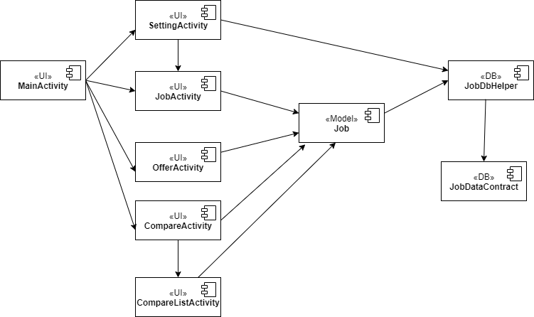
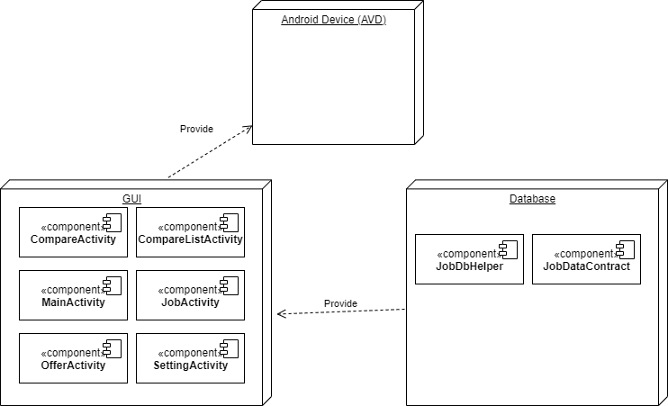
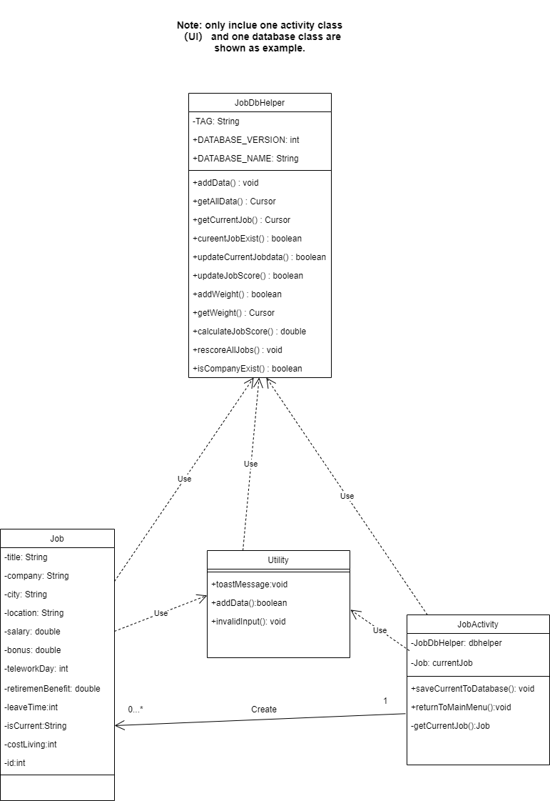
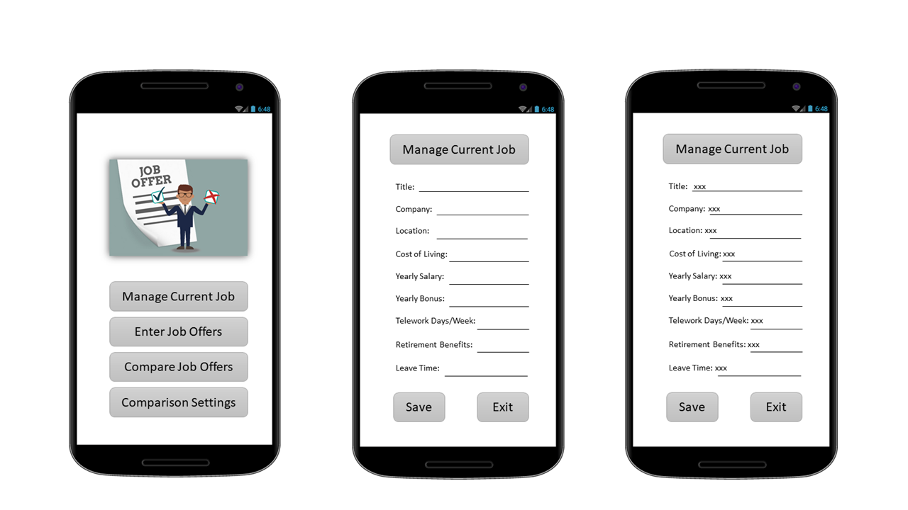
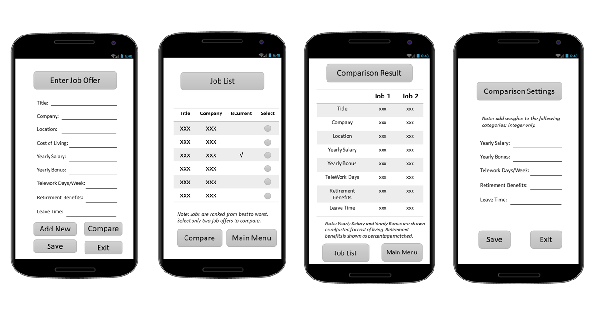
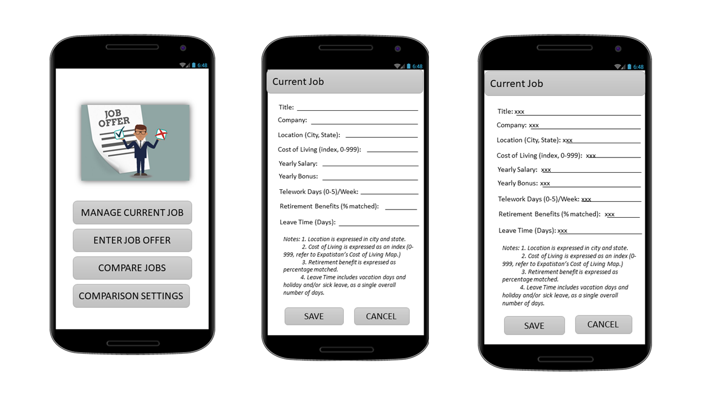
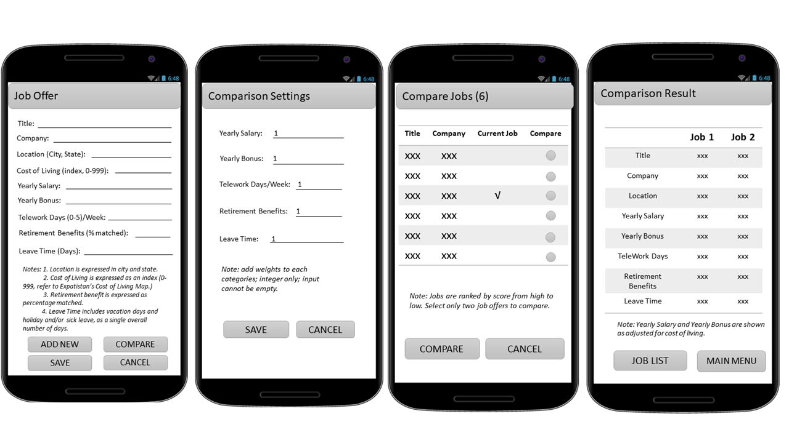

# Design Document

**Author**: \<Team60\>

## 1 Design Considerations

The description of the issues that inspire our design are briefly stated in the sub sections below.

### 1.1 Assumptions

•	Assumptions about the user :

 The application is a single-user application.
 
•	Technical Assumptions:

   a.   The Job Offer Comparison application is meant to run on Android platform.
  
   b.   The Application is dependent on integrated development environment (IDE) for Google's Android operating system：Android Studio， which contains libraries, debugger and an emulator.
  
•	Business Assumptions: 

The App will be developed in 2 weeks timeframe.

### 1.2 Constraints

•	The scope of development of the App will be based on the identified requirement.

•	A persistent layer would be used by the application to maintain persistent information; SQLite Database.

•	The application will be implemented within 2 weeks timeframe.

•	The resources/staff are limited to a 4-team member.

### 1.3 System Environment

Hardware
•	Regular Android mobile phones or emulator.

Software
•	Java programming language will be use as the application development. 

•	Android Studio with minimum SDK API  level 28: Android 9.0.  

•	SQLite  - Database tool which is included in the Android SDK and Emulators.

•	XML – to make changes to the layout of the application.

•	Android emulator can be used for testing the Android application. 

## 2 Architectural Design

The key Subsystem identified from the Use Cases for the architecture are as follows;
a.	Current Job 
b.	Job Offer 
c.	Compare Job Offers
d.	Adjust Comparison settings

### 2.1 Component Diagram

### 2.2 Deployment Diagram

## 3 Low-Level Design

### 3.1 Class Diagram

## 4 User Interface Design

### 4.1 GUI Version 1 (initial design)

### 4.2 GUI Version 2 (final design)

