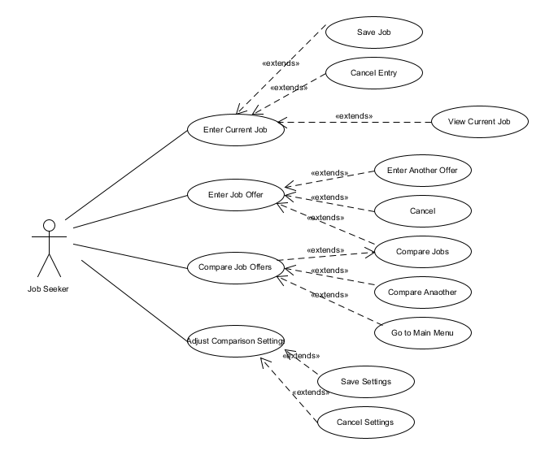

# Use Case Model

**Author**: \<Team 60\>

## 1 Use Case Diagram

## 2 Use Case Descriptions

### 2.1 Current Job
#### 2.1.1 Enter Current Job

* **Requirements**: This use case allows the Job Seeker to enter information for the *Current* Job
* **Pre-conditions**: Job Seeker clicks on Manage Current Job from the start-up Menu
* **Post-conditions**: None
* **Scenarios**: The Job Seeker wants to enter, edit, or view information about their current job. The Job Seeker clicks on Manage Current Job and is brought to the Manage Current Job GUI

#### 2.1.2 View Current Job

* **Requirements**: This use case allows the Job Seeker to view information for the *Current* Job
* **Pre-conditions**: The GUI is in the Manage Current Job screen
* **Post-conditions**: The Job Seeker presses Cancel/Exit after viewing job
* **Scenarios**: The Job Seeker wants to view information about their current job. The Job Seeker clicks on Manage Current Job and is brought to the Mange Current Job GUI. Afgter viewing the job, the Job Seeker presses Cancel/Exit

#### 2.1.2 Save Current Job

* **Requirements**: This use case allows the Job Seeker to save information for the *Current* Job
* **Pre-conditions**: The GUI is in the Manage Current Job screen
* **Post-conditions**: The Job Seeker presses Save after data is entered. All fields must be entered in order to save
* **Scenarios**: The Job Seeker wants to enter or edit information about their current job. The Job Seeker clicks on Manage Current Job and is brought to the Mange Current Job GUI. The Job Seeker enters all required information in the GUI.

#### 2.1.3 Cancel Current Job Entry

* **Requirements**: This use case allows the Job Seeker to cancel any editing or entry for the *Current* Job and return to the main screen
* **Pre-conditions**: The GUI is in the Manage Current Job screen
* **Post-conditions**: The Job Seeker presses Cancel/Exit at any time.  Information about the current job is *NOT* changed
* **Scenarios**: The Job Seeker was entering or editing the current job and decides to revert to the main menu.  THe Job Seeker presses the Exit button

### 2.2 Job Offers
#### 2.2.1 Enter Job Offer

* **Requirements**: This use case allows the Job Seeker to enter information for the *Job Offer*
* **Pre-conditions**: Job Seeker clicks on Enter Job Offers from the start-up Menu
* **Post-conditions**: None
* **Scenarios**: The Job Seeker wants to enter information for a new job offer. The Job Seeker clicks on Enter Job Offers and is brought to the Mange Current Job GUI.  The Job Seeker can enter job offer information.  During entry, the job Seeker can click on Cancel/Exit at any time or Add New, Save, or Compare after entry is complete. If the GUI is blank, the user can clock on Compare to compare the newly entered job and the current job.

#### 2.2.2 Enter Another Job

* **Requirements**: This use case allows the Job Seeker to add another job offer
* **Pre-conditions**: The GUI is in the Enter Job Offers  screen and the current job has been successfully saved by previous clock on Save. The Job Seeker clicks on Add New
* **Post-conditions**: The GUI will present the Job Seeker with a blank entry indicating that a new job is ready to enter
* **Scenarios**: The Job Seeker has finished entry for a job offer.  The Job Seeker can easily add another job offer by simply clicking on Add New.  Alternatively, the Job Seeker can immediately cancel by clicking Main Menu

#### 2.2.2 Save Job Offer

* **Requirements**: This use case allows the Job Seeker to save information for the Job offer
* **Pre-conditions**: The GUI is in the Enter Job Offer screen
* **Post-conditions**: The Job Seeker presses Save after data is entered. All fields must be entered in order to save
* **Scenarios**: The Job Seeker wants to enter information about a job offer. The Job Seeker clicks on Enter Job Offers and is brought to the Mange Current Job GUI. The Job Seeker enters all required information in the GUI and clicks on Save.  

#### 2.2.3 Cancel Job Offer Entry

* **Requirements**: This use case allows the Job Seeker to cancel the entry for a Job Offer and return to the main scfreen
* **Pre-conditions**: The GUI is in the Enter Job Offer screen
* **Post-conditions**: The Job Seeker presses Cancel/Exit at any time.  Information about the job offer is discarded and the GUI returns to the main screen
* **Scenarios**: The Job Seeker was entering the job offer and decides to revert to the main menu.  THe Job Seeker presses the Exit button

#### 2.2.4 Compare Job Offers

* **Requirements**: This use case allows the Job Seeker to compare Job Offers directly from the Enter Job Offer Screen
* **Pre-conditions**: The GUI is in the Enter Job Offer screen and all Job offers are saved
* **Post-conditions**: The Use case continues to 2.3.2, Compare Jobs
* **Scenarios**: The Job Seeker completed entering job offers and now wants to go directly to the Compare Jobs Function

### 2.3 Compare Jobs
#### 2.3.1 Compare Job Offers

* **Requirements**: This use case allows the Job Seeker to use the Job List GUI to initiate comparisons of offers
* **Pre-conditions**: Job Seeker clicks on Compare Job Offers from the start-up Menu
* **Post-conditions**: The Job Seeker enters the Job List GUI
* **Scenarios**: The Job seeker is at the main menu and and wants to compare job offers.  The Job Seeker clicks on Compare Job Offers.

#### 2.3.2 Compare Jobs

* **Requirements**: This use case allows the Job Seeker to use the Job List GUI to run the comparison of the jobs
* **Pre-conditions**: GUI is in the Jobs List GUI.  Jobs are listed in rank order. Job Seeker selects exactly two jobs to compare
* **Post-conditions**: The Job Seeker enters the Comparison Result GUI
* **Scenarios**: The Job seeker is ready to compare job offers.  The Jobs seeker reviews the job summary information and selects the two jobs to compare. The Jobs seeker then clicks the compare button and is brought to the Comparison Result GUI. The User can review the offers 

#### 2.3.2 Compare Another

* **Requirements**: This use case allows the Job Seeker to run another job comparison while in the Compison Result GUI
* **Pre-conditions**: GUI is in the Comparison Result GUI.  Job Seeker clicks on Job list button
* **Post-conditions**: The Job Seeker enters the Jobs List GUI
* **Scenarios**: The Job seeker has reviewed the data in the Job comparison GUI.  Job Seeker then decides to do another comparison

#### 2.3.2 Go To Main Menu

* **Requirements**: This use case allows the Job Seeker to return to the main menu from any job comparison screen
* **Pre-conditions**: GUI is in the Job List or Comparison Result GUI.  Job Seeker clicks on Main Menu
* **Post-conditions**: The Job Seeker enters startup screen GUI
* **Scenarios**: 1) The Job seeker has reviewed the data in the Job comparison GUI.  Job Seeker then decides to return to the main menu. 2) The Job seeker has entered all job offers and decides to return to the main menu 3) The Job Seeker decides to cancel or not start entry for a new job offer and wants to return to the main menu.

### 2.3 Comparison Settings
#### 2.3.1 Adjust Comparison Settings

* **Requirements**: This use case allows the Job Seeker to adjust parameters used for job comparison
* **Pre-conditions**: Job Seeker clicks on Comparison Setting from the start-up Menu
* **Post-conditions**: The Job Seeker enters the Comparison Settings GUI
* **Scenarios**: The Job seeker is at the main menu and and wants to adjust the comparison settings.  The Job Seeker clicks on Comparison Setting.

#### 2.3.1 Save Comparison Settings

* **Requirements**: This use case allows the Job Seeker to save parameters used for job comparison
* **Pre-conditions**: Job Seeker is in the Comparison Settings GUI
* **Post-conditions**: Comparison settings must be valid
* **Scenarios**: After the Job Seeker has entered valid settings and is satisfied and clicks on Save. 

#### 2.3.2 Cancel Settings

* **Requirements**: This use case allows the Job Seeker to cancel entry of updated or new parameters used for job comparison
* **Pre-conditions**: Job Seeker is in the Comparison Settings GUI
* **Post-conditions**: Comparison settings revert to last used. GUI reverts to main menu
* **Scenarios**: After the Job Seeker has decided to cancel entry of the comparison setting and clicks on Exit

